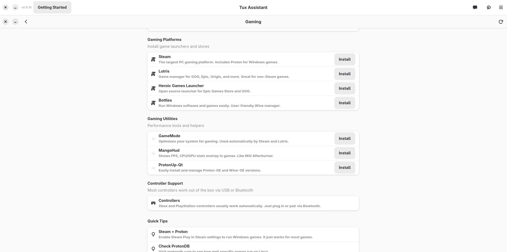
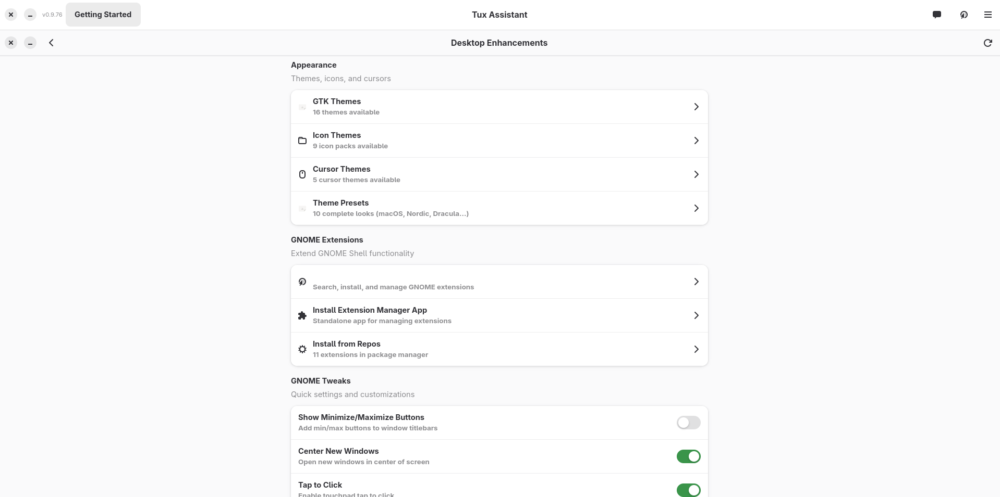
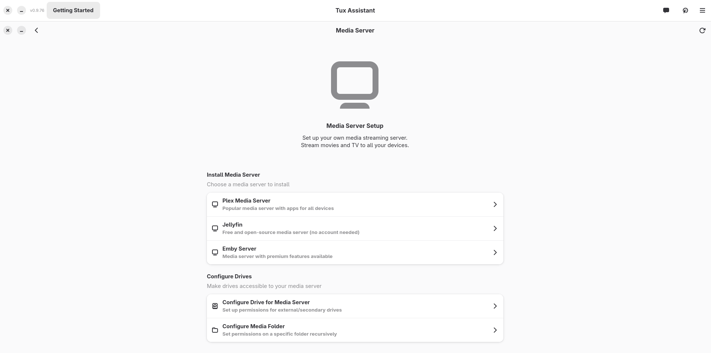
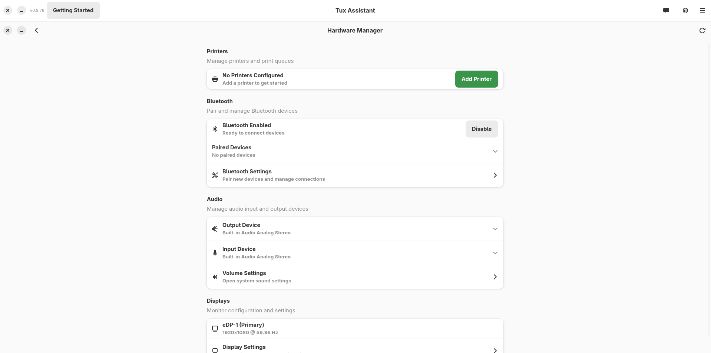
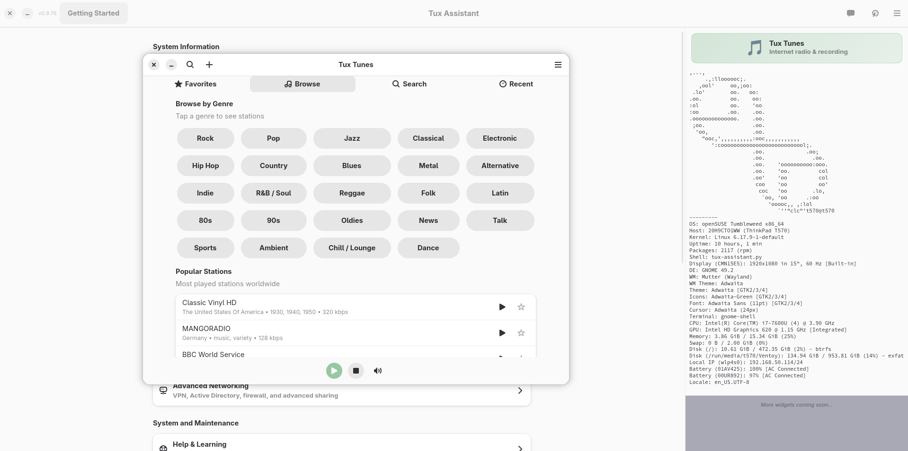

# Tux Assistant

<p align="center">
  
</p>

<p align="center">
  <strong>Your friendly Linux post-installation companion</strong><br>
  <em>38,000+ lines of Python • GTK4/Libadwaita • Multi-distro support</em>
</p>

<p align="center">
  <a href="#features">Features</a> •
  <a href="#screenshots">Screenshots</a> •
  <a href="#installation">Installation</a> •
  <a href="#included-apps">Apps</a> •
  <a href="#supported-distributions">Distros</a>
</p>

<p align="center">
  
</p>

---

## What is Tux Assistant?

Tux Assistant is a **GTK4/Libadwaita application** that simplifies Linux post-installation setup. Instead of hunting through wikis and running dozens of terminal commands, Tux Assistant provides a friendly GUI to configure your system, install software, and set up services.

**Built for humans, not just power users.**

---

## Features

| Category | What You Get |
|----------|--------------|
| 🛠️ **Setup Tools** | Codecs, drivers, fonts, essential system configuration |
| 📦 **Software Center** | One-click install of popular applications |
| 🎮 **Gaming** | Steam, Lutris, Wine, Proton, MangoHud, and more |
| 🖥️ **Desktop Enhancements** | Themes, icons, fonts, GNOME extensions browser |
| 🌐 **Networking** | Samba shares, SSH, VPN, Speed Test, firewall |
| 🎬 **Media Servers** | Plex, Jellyfin, Emby setup wizards |
| 🔧 **Hardware Manager** | GPU drivers, Bluetooth, printers, system info |
| 🧹 **System Maintenance** | Updates, cleanup, logs, services management |
| ☁️ **Nextcloud** | Deploy your own private cloud |
| 🎵 **Tux Tunes** | Internet radio with 50,000+ stations |

---

## Screenshots

<p align="center">
  
</p>
<p align="center"><em>Setup Tools - Codecs, drivers, and essential configuration</em></p>

<p align="center">
  
</p>
<p align="center"><em>Software Center - One-click install of popular applications</em></p>

<p align="center">
  
</p>
<p align="center"><em>Gaming - Steam, Lutris, Wine, Proton, and gaming utilities</em></p>

<p align="center">
  
</p>
<p align="center"><em>Desktop Enhancements - Themes, icons, fonts, GNOME extensions</em></p>

<p align="center">
  
</p>
<p align="center"><em>Networking - Samba, SSH, VPN, Speed Test, firewall configuration</em></p>

<p align="center">
  
</p>
<p align="center"><em>Media Server - Plex, Jellyfin, and Emby setup</em></p>

<p align="center">
  
</p>
<p align="center"><em>Hardware Manager - GPU drivers, Bluetooth, printers, system info</em></p>

<p align="center">
  
</p>
<p align="center"><em>System Maintenance - Updates, cleanup, logs, services</em></p>

---

## Included Apps

### Tux Tunes 🎵

<p align="center">
  
</p>

Internet radio player with access to **50,000+ stations** via radio-browser.info.

**Features:**
- Search and browse stations by genre, country, language
- Save favorites and custom stations
- Smart recording with automatic song detection
- Pre-buffering to capture complete songs
- Beautiful GTK4/Libadwaita interface

---

## Installation

### Arch Linux (AUR) - Recommended

```bash
yay -S tux-assistant
```

### Other Distributions - Download .run Installer

Download the latest `.run` file from [Releases](https://github.com/dorrellkc/Tux-Assistant/releases):

```bash
chmod +x Tux-Assistant-v*.run
./Tux-Assistant-v*.run
```

### From Source

```bash
git clone https://github.com/dorrellkc/tux-assistant.git
cd tux-assistant
sudo ./install.sh
```

### Requirements

- Python 3.10+
- GTK 4.0+
- Libadwaita 1.0+
- GStreamer 1.0+ (for Tux Tunes)

### Launch

After installation:
- **Tux Assistant** - Find in your app menu or run `tux-assistant`
- **Tux Tunes** - Find in your app menu or run `tux-tunes`

---

## Supported Distributions

| Distribution | Status | Notes |
|-------------|--------|-------|
| Arch Linux | ✅ Full Support | Available on AUR |
| EndeavourOS | ✅ Full Support | Primary dev platform |
| CachyOS | ✅ Full Support | |
| Manjaro | ✅ Full Support | |
| Fedora | ✅ Full Support | Tested on F43 |
| openSUSE | ✅ Full Support | Leap & Tumbleweed |
| Ubuntu | ✅ Full Support | 22.04+ |
| Linux Mint | ✅ Full Support | 21+ |
| Debian | ⚠️ Partial | Needs libadwaita 1.4+ |

---

## Project Structure

```
tux-assistant/
├── tux/
│   ├── apps/           # Standalone applications
│   │   └── tux_tunes/  # Internet radio player
│   ├── modules/        # Feature modules (each page)
│   ├── core/           # Shared libraries (distro detection, packages)
│   └── ui/             # UI components (GNOME extensions, etc.)
├── assets/             # Icons (SVG)
├── screenshots/        # README screenshots
├── data/               # Desktop entries, polkit policies
├── scripts/            # Build scripts
├── install.sh          # Installation script
└── tux-assistant.py    # Main entry point
```

---

## Contributing

Contributions are welcome! Please feel free to submit issues and pull requests.

---

## License

Copyright © 2025 Christopher Dorrell. Licensed under GPL-3.0.

---

## Acknowledgments

- [radio-browser.info](https://www.radio-browser.info/) - Free internet radio station database
- [GNOME](https://www.gnome.org/) - GTK and Libadwaita
- The Linux community for testing and feedback

---

<p align="center">
  Made with 🐧 by Christopher Dorrell
</p>

<p align="center">
  <a href="https://github.com/dorrellkc/Tux-Assistant">GitHub</a> •
  <a href="https://aur.archlinux.org/packages/tux-assistant">AUR</a>
</p>
